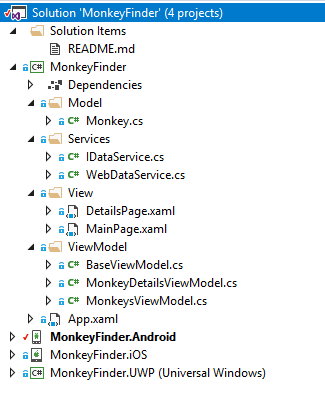
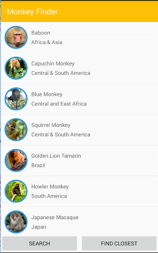
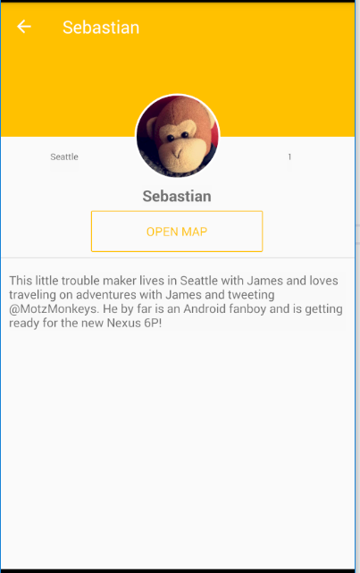

# Xamarin Monkeys - Hands On Lab

Today we will build a cloud connected [Xamarin.Forms](https://docs.microsoft.com/xamarin/) application that will display a list of Monkeys from around the world. We will start by building the business logic backend that pulls down json-ecoded data from a RESTful endpoint. We will then leverage [Xamarin.Essentials](https://docs.microsoft.com/xamarin/essentials/index) to find the closest monkey to us and also show the monkey on a map. Finally, we will connect it to an Azure backend leveraging [Azure Cosmos DB](https://azure.microsoft.com/services/cosmos-db/) and [Azure Functions](https://azure.microsoft.com/en-us/services/functions/) in just a few lines of code.

## Setup Guide
Follow our simple [setup guide](https://github.com/xamarin/dev-days-labs/raw/master/Xamarin%20Workshop%20Setup.pdf) to ensure you have Visual Studio and Xamarin setup and ready to deploy.

## Mobile App Walkthrough

### 1. Open Solution in Visual Studio

1. Open **Start/MonkeyFinder.sln**

This MonkeyFinder contains 4 projects

* MonkeyFinder  - Shared .NET Standard project that will have all shared code (model, views, view models, and services)
* MonkeyFinder.Android - Xamarin.Android application
* MonkeyFinder.iOS - Xamarin.iOS application (requires a macOS build host)
* MonkeyFinder.UWP - Windows 10 UWP application (requires Visual Studio /2017 on Windows 10)



The **MonkeyFinder** project also has blank code files and XAML pages that we will use during the Hands on Lab. All of the code that we modify will be in this project for the workshop.

### 2. NuGet Restore

All projects have the required NuGet packages already installed, so there will be no need to install additional packages during the Hands on Lab. The first thing that we must do is restore all of the NuGet packages from the internet.

1. **Right-click** on the **Solution** and selecting **Restore NuGet packages...**


### 3. Model

We will download details about the monkey and will need a class to represent it.

We can easily convert our json file located at [montemagno.com/monkeys.json]("https://montemagno.com/monkeys.json) by using [quicktype.io](https://app.quicktype.io/) and pasting the raw json into quicktype to generate our C# classes. Ensure that you set the Name to `Monkey` and the generated namespace to `MonkeyFinder.Model` and select C#. Here is a direct URL to the code: [https://app.quicktype.io?share=W43y1rUvk1FBQa5RsBC0](https://app.quicktype.io?share=W43y1rUvk1FBQa5RsBC0)


1. Open `Model/Monkey.cs`
2. In `Monkey.cs`, copy/paste the following:

```csharp
public partial class Monkey
{
    [JsonProperty("Name")]
    public string Name { get; set; }

    [JsonProperty("Location")]
    public string Location { get; set; }

    [JsonProperty("Details")]
    public string Details { get; set; }

    [JsonProperty("Image")]
    public Uri Image { get; set; }

    [JsonProperty("Population")]
    public long Population { get; set; }

    [JsonProperty("Latitude")]
    public double Latitude { get; set; }

    [JsonProperty("Longitude")]
    public double Longitude { get; set; }
}

public partial class Monkey
{
    public static Monkey[] FromJson(string json) => JsonConvert.DeserializeObject<Monkey[]>(json, MonkeyFinder.Model.Converter.Settings);
}

public static class Serialize
{
    public static string ToJson(this Monkey[] self) => JsonConvert.SerializeObject(self, MonkeyFinder.Model.Converter.Settings);
}

internal static class Converter
{
    public static readonly JsonSerializerSettings Settings = new JsonSerializerSettings
    {
        MetadataPropertyHandling = MetadataPropertyHandling.Ignore,
        DateParseHandling = DateParseHandling.None,
        Converters =
        {
            new IsoDateTimeConverter { DateTimeStyles = DateTimeStyles.AssumeUniversal }
        },
    };
}
```

### 4. Implementing INotifyPropertyChanged

*INotifyPropertyChanged* is important for data binding in MVVM Frameworks. This is an interface that, when implemented, lets our view know about changes to the model. We will implement it once in our `BaseViewModel` so all other view models that we can create can inherit from it.

1. In Visual Studio, open `ViewModel/BaseViewModel.cs`
2. In `BaseViewModel.cs`, implement INotifyPropertyChanged by changing this

```csharp
public class BaseViewModel
{

}
```

to this

```csharp
public class BaseViewModel : INotifyPropertyChanged
{

}
```

3. In `BaseViewModel.cs`, right click on `INotifyPropertyChanged`
4. Implement the `INotifyPropertyChanged` Interface
   - (Visual Studio Mac) In the right-click menu, select Quick Fix -> Implement Interface
   - (Visual Studio PC) In the right-click menu, select Quick Actions and Refactorings -> Implement Interface
5. In `BaseViewModel.cs`, ensure this line of code now appears:

```csharp
public event PropertyChangedEventHandler PropertyChanged;
```

6. In `BaseViewModel.cs`, create a new method called `OnPropertyChanged`
    - Note: We will call `OnPropertyChanged` whenever a property updates

```csharp
private void OnPropertyChanged([CallerMemberName] string name = null)
{

}
```

7. Add code to `OnPropertyChanged`:

```csharp
private void OnPropertyChanged([CallerMemberName] string name = null) =>
    PropertyChanged?.Invoke(this, new PropertyChangedEventArgs(name));
```

### 5. Implementing Title, IsBusy, and IsNotBusy

We will create a backing field and accessors for a few properties. These properties will allow us to set the title on our pages and also let our view know that our view model is busy so we don't perform duplicate operations (like allowing the user to refresh the data multiple times). They are in the `BaseViewModel` because they are common for every page.

1. In `BaseViewModel.cs`, create the backing field:

```csharp
public class BaseViewModel : INotifyPropertyChanged
{
    bool isBusy;
    string title;
    //...
}
```

2. Create the properties:

```csharp
public class SpeakersViewModel : INotifyPropertyChanged
{
    //...
     public bool IsBusy
    {
        get => isBusy;
        set
        {
            if (isBusy == value)
                return;
            isBusy = value;
            OnPropertyChanged();
        }
    }

    public string Title
    {
        get => title;
        set
        {
            if (title == value)
                return;
            title = value;
            OnPropertyChanged();
        }
    }
    //...
}
```

Notice that we call `OnPropertyChanged` when the value changes. The Xamarin.Forms binding infrastructure will subscribe to our **PropertyChanged** event so the UI will be notified of the change.

We can also create the inverse of `IsBusy` by creating another property called `IsNotBusy` that returns the opposite of `IsBusy` and then raising the event of `OnPropertyChanged` when we set `IsBusy`

```csharp
public class SpeakersViewModel : INotifyPropertyChanged
{
    //...
    public bool IsBusy
    {
        get => isBusy;
        set
        {
            if (isBusy == value)
                return;
            isBusy = value;
            OnPropertyChanged();
            // Also raise the IsNotBusy property changed
            OnPropertyChanged(nameof(IsNotBusy));
        }
    } 

    public bool IsNotBusy => !IsBusy;
    //...
}
```

### 6. Creating our Data Service

Inside our our `Services` folder lives two files that represent an interface contract (`IDataService`) for getting the data and an implementation that we will fill in (`WebDataService`).

1. Let's first create the interface in `Services/IDataService.cs`. It will be a simple method that returns a Task of a list of monkeys. Place this code inside of: `public interface IDataService`

```csharp
Task<IEnumerable<Monkey>> GetMonkeysAsync();
```

Next, inside of `Services/WebDataService.cs` will live the implementation to get these monkeys. I have already brought in the namespaces required for the implementation.

2. We can now implement that interface. First by adding `IDataService` to the class:

Before:

```csharp
public class WebDataService 
{
}
```

After:

```csharp
public class WebDataService : IDataService
{
}
```

3. Implement the `IDataService` Interface
   - (Visual Studio for Mac) In the right-click menu, select Quick Fix -> Implement Interface
   - (Visual Studio PC) In the right-click menu, select Quick Actions and Refactorings -> Implement Interface

Before implementing `GetMonkeysAsync` we will setup our HttpClient by setting up a shared instance inside of the class:

```csharp
HttpClient httpClient;
HttpClient Client => httpClient ?? (httpClient = new HttpClient());
```

Now we can implement the method. We will be using async calls, so we must add the `async` attribute to the method:

Before:

```csharp
public Task<IEnumerable<Monkey>> GetMonkeysAsync()
{
}
```

After:

```csharp
public async Task<IEnumerable<Monkey>> GetMonkeysAsync()
{
}
```

To get the data from our server and parse it is actually extremely easy by leveraging `HttpClient` and `Json.NET`:

```csharp
public async Task<IEnumerable<Monkey>> GetMonkeysAsync()
{
    var json = await Client.GetStringAsync("https://montemagno.com/monkeys.json");
    var all = Monkey.FromJson(json);
    return all;
}
```

Note that in this file is a line of a code above the namespace `[assembly:Dependency(typeof(WebDataService))]`. This is the Xamarin.Forms dependency service which will automatically register this class and it's interface that we can retrieve a global instance of later.

4. Let's end by ensuring we have reference at any time to this implementation by retrieving it in our `BaseViewModel` by adding the following code in the class:

```csharp
public IDataService DataService { get; }
public BaseViewModel()
{
    DataService = DependencyService.Get<IDataService>();
}
```

### 6. Create ObservableCollection of Monkeys

We will use an `ObservableCollection<Monkey>` that will be cleared and then loaded with **Monkey** objects. We use an `ObservableCollection` because it has built-in support to raise `CollectionChanged` events when we Add or Remove items from the collection. This means we don't call `OnPropertyChanged` when updating the collection.

1. In `MonkeysViewModel.cs` declare an auto-property which we will initialize to an empty collection. Also, we can set our Title to `Monkey Finder`.

```csharp
public class MonkeysViewModel : BaseViewModel
{
    //...
    public ObservableCollection<Monkey> Monkeys { get; }
    public MonkeysViewModel()
    {
        Title = "Monkey Finder";
        Monkeys = new ObservableCollection<Monkey>();
    }
    //...
}
```

### 7. Create GetMonkeysAsync Method

We are ready to create a method named `GetMonkeysAsync` which will retrieve the monkey data from the internet. We will first implement this with a simple HTTP request, and later update it to grab and sync the data from Azure!

1. In `SpeakersViewModel.cs`, create a method named `GetMonkeysAsync` with that returns `async Task`:

```csharp
public class MonkeysViewModel : BaseViewModel
{
    //...
    async Task GetMonkeysAsync()
    {
    }
    //...
}
```

2. In `GetMonkeysAsync`, first ensure `IsBusy` is false. If it is true, `return`

```csharp
async Task GetMonkeysAsync()
{
    if (IsBusy)
        return;
}
```

3. In `GetMonkeysAsync`, add some scaffolding for try/catch/finally blocks
    - Notice, that we toggle *IsBusy* to true and then false when we start to call to the server and when we finish.

```csharp
async Task GetMonkeysAsync()
{
    if (IsBusy)
        return;

    try
    {
        IsBusy = true;

    }
    catch (Exception ex)
    {

    }
    finally
    {
       IsBusy = false;
    }

}
```

4. In the `try` block of `GetMonkeysAsync`, we can get the monkeys from our Data Service.

```csharp
async Task GetMonkeysAsync()
{
    ...
    try
    {
        IsBusy = true;

        var monkeys = await DataService.GetMonkeysAsync();
    }
    ... 
}
```

6. Inside of the `using`, clear the `Monkeys` property and then add the new monkey data:

```csharp
async Task GetMonkeysAsync()
{
    //...
    try
    {
        IsBusy = true;

        var monkeys = await DataService.GetMonkeysAsync();

        Monkeys.Clear();
        foreach (var monkey in monkeys)
            Monkeys.Add(monkey);
    }
    //...
}
```

7. In `GetMonkeysAsync`, add this code to the `catch` block to display a popup if the data retrieval fails:

```csharp
async Task GetMonkeysAsync()
{
    //...
    catch(Exception ex)
    {
        Debug.WriteLine($"Unable to get monkeys: {ex.Message}");
        await Application.Current.MainPage.DisplayAlert("Error!", ex.Message, "OK");
    }
    //...
}
```

8. Ensure the completed code looks like this:

```csharp
async Task GetMonkeysAsync()
{
    if (IsBusy)
        return;

    try
    {
        IsBusy = true;

        var monkeys = await DataService.GetMonkeysAsync();

        Monkeys.Clear();
        foreach (var monkey in monkeys)
            Monkeys.Add(monkey);
    }
    catch (Exception ex)
    {
        Debug.WriteLine($"Unable to get monkeys: {ex.Message}");
        await Application.Current.MainPage.DisplayAlert("Error!", ex.Message, "OK");
    }
    finally
    {
        IsBusy = false;
    }
}
```

Our main method for getting data is now complete!

#### 8. Create GetMonkeys Command

Instead of invoking this method directly, we will expose it with a `Command`. A `Command` has an interface that knows what method to invoke and has an optional way of describing if the Command is enabled.

1. In `MonkeysViewModel.cs`, create a new Command called `GetMonkeysCommand`:

```csharp
public class MonkeysViewModel : BaseViewModel
{
    //...
    public Command GetMonkeysCommand { get; }
    //...
}
```

2. Inside of the `SpeakersViewModel` constructor, create the `GetSpeakersCommand` and pass it two methods
    - One to invoke when the command is executed
    - Another that determines if the command is enabled. Both methods can be implemented as lambda expressions as shown below:

```csharp
public class MonkeysViewModel : BaseViewModel
{
    //...
    public MonkeysViewModel()
    {
        //...
        GetMonkeysCommand = new Command(async () => await GetMonkeysAsync());
    }
    //...
}
```

## 9. Build The Monkeys User Interface
It is now time to build the Xamarin.Forms user interface in `View/MainPage.xaml`. Our end result is to build a page that looks like this:



1. In `MainPage.xaml`, add a `BindingContext` between the `ContentPage` tags, which will enable us to get binding intellisense:

```xml
<?xml version="1.0" encoding="utf-8" ?>
<ContentPage xmlns="http://xamarin.com/schemas/2014/forms"
             xmlns:x="http://schemas.microsoft.com/winfx/2009/xaml"
             xmlns:local="clr-namespace:MonkeyFinder"
             xmlns:viewmodel="clr-namespace:MonkeyFinder.ViewModel"
             xmlns:circle="clr-namespace:ImageCircle.Forms.Plugin.Abstractions;assembly=ImageCircle.Forms.Plugin"
             x:Class="MonkeyFinder.View.MainPage">

    <!-- Add this -->
    <ContentPage.BindingContext>
        <viewmodel:MonkeysViewModel/>
    </ContentPage.BindingContext>

</ContentPage>
```

2. We can create our first binding on the `ContentPage` by adding the `Title` Property:

```xml
<?xml version="1.0" encoding="utf-8" ?>
<ContentPage xmlns="http://xamarin.com/schemas/2014/forms"
             xmlns:x="http://schemas.microsoft.com/winfx/2009/xaml"
             xmlns:local="clr-namespace:MonkeyFinder"
             xmlns:viewmodel="clr-namespace:MonkeyFinder.ViewModel"
             xmlns:circle="clr-namespace:ImageCircle.Forms.Plugin.Abstractions;assembly=ImageCircle.Forms.Plugin"
             x:Class="MonkeyFinder.View.MainPage"
             Title="{Binding Title}"> <!-- Add this -->

    <ContentPage.BindingContext>
        <viewmodel:MonkeysViewModel/>
    </ContentPage.BindingContext>

</ContentPage>
```

2. In the `MainPage.xaml`, we can add a `Grid` between the `ContentPage` tags with 2 rows and 2 columns. We will also set the `RowSpacing` and `ColumnSpacing` to

```xml
<?xml version="1.0" encoding="utf-8" ?>
<ContentPage xmlns="http://xamarin.com/schemas/2014/forms"
             xmlns:x="http://schemas.microsoft.com/winfx/2009/xaml"
             xmlns:local="clr-namespace:MonkeyFinder"
             xmlns:viewmodel="clr-namespace:MonkeyFinder.ViewModel"
             xmlns:circle="clr-namespace:ImageCircle.Forms.Plugin.Abstractions;assembly=ImageCircle.Forms.Plugin"
             x:Class="MonkeyFinder.View.MainPage"
             Title="{Binding Title}">

    <ContentPage.BindingContext>
        <viewmodel:MonkeysViewModel/>
    </ContentPage.BindingContext>

    <!-- Add this -->
    <Grid RowSpacing="0" ColumnSpacing="5">
        <Grid.RowDefinitions>
            <RowDefinition Height="*"/>
            <RowDefinition Height="Auto"/>
        </Grid.RowDefinitions>
        <Grid.ColumnDefinitions>
            <ColumnDefinition Width="*"/>
            <ColumnDefinition Width="*"/>
        </Grid.ColumnDefinitions>
    </Grid>
</ContentPage>
```

3. In the `MainPage.xaml`, we can add a `ListView` between the `Grid` tags that spans 2 Columns. We will also set the `ItemsSource` which will bind to our `Monkeys` ObservableCollection and additionally set a few properties for optimizing the list.

```xml
<?xml version="1.0" encoding="utf-8" ?>
<ContentPage xmlns="http://xamarin.com/schemas/2014/forms"
             xmlns:x="http://schemas.microsoft.com/winfx/2009/xaml"
             xmlns:local="clr-namespace:MonkeyFinder"
             xmlns:viewmodel="clr-namespace:MonkeyFinder.ViewModel"
             xmlns:circle="clr-namespace:ImageCircle.Forms.Plugin.Abstractions;assembly=ImageCircle.Forms.Plugin"
             x:Class="MonkeyFinder.View.MainPage"
             Title="{Binding Title}">

    <ContentPage.BindingContext>
        <viewmodel:MonkeysViewModel/>
    </ContentPage.BindingContext>

    <!-- Add this -->
    <Grid RowSpacing="0" ColumnSpacing="5">
        <Grid.RowDefinitions>
            <RowDefinition Height="*"/>
            <RowDefinition Height="Auto"/>
        </Grid.RowDefinitions>
        <Grid.ColumnDefinitions>
            <ColumnDefinition Width="*"/>
            <ColumnDefinition Width="*"/>
        </Grid.ColumnDefinitions>
         <ListView ItemsSource="{Binding Monkeys}"
                  CachingStrategy="RecycleElement"
                  HasUnevenRows="True"
                  Grid.ColumnSpan="2">

        </ListView>
    </Grid>
</ContentPage>
```

4. In the `MainPage.xaml`, we can add a `ItemTemplate` to our `ListView` that will represent what each item in the list displays:

```xml
<?xml version="1.0" encoding="utf-8" ?>
<ContentPage xmlns="http://xamarin.com/schemas/2014/forms"
             xmlns:x="http://schemas.microsoft.com/winfx/2009/xaml"
             xmlns:local="clr-namespace:MonkeyFinder"
             xmlns:viewmodel="clr-namespace:MonkeyFinder.ViewModel"
             xmlns:circle="clr-namespace:ImageCircle.Forms.Plugin.Abstractions;assembly=ImageCircle.Forms.Plugin"
             x:Class="MonkeyFinder.View.MainPage"
             Title="{Binding Title}">

    <ContentPage.BindingContext>
        <viewmodel:MonkeysViewModel/>
    </ContentPage.BindingContext>

    <Grid RowSpacing="0" ColumnSpacing="5">
        <Grid.RowDefinitions>
            <RowDefinition Height="*"/>
            <RowDefinition Height="Auto"/>
        </Grid.RowDefinitions>
        <Grid.ColumnDefinitions>
            <ColumnDefinition Width="*"/>
            <ColumnDefinition Width="*"/>
        </Grid.ColumnDefinitions>
         <ListView ItemsSource="{Binding Monkeys}"
                  CachingStrategy="RecycleElement"
                  HasUnevenRows="True"
                  Grid.ColumnSpan="2">
            <!-- Add this -->
            <ListView.ItemTemplate>
                <DataTemplate>
                    <ViewCell>
                        <Grid ColumnSpacing="10" Padding="10">
                            <Grid.ColumnDefinitions>
                                <ColumnDefinition Width="60"/>
                                <ColumnDefinition Width="*"/>
                            </Grid.ColumnDefinitions>
                            <Image Source="{Binding Image}"
                                    HorizontalOptions="Center"
                                    VerticalOptions="Center"
                                    WidthRequest="60"
                                    HeightRequest="60"
                                    Aspect="AspectFill"/>
                            <StackLayout Grid.Column="1" VerticalOptions="Center">
                                <Label Text="{Binding Name}"/>
                                <Label Text="{Binding Location}"/>
                            </StackLayout>
                        </Grid>
                    </ViewCell>
                </DataTemplate>
            </ListView.ItemTemplate>
        </ListView>
    </Grid>
</ContentPage>
```

5. In the `MainPage.xaml`, we can add a `Button` under our `ListView` that will enable us to click it and get the monkeys from the server:

```xml
<?xml version="1.0" encoding="utf-8" ?>
<ContentPage xmlns="http://xamarin.com/schemas/2014/forms"
             xmlns:x="http://schemas.microsoft.com/winfx/2009/xaml"
             xmlns:local="clr-namespace:MonkeyFinder"
             xmlns:viewmodel="clr-namespace:MonkeyFinder.ViewModel"
             xmlns:circle="clr-namespace:ImageCircle.Forms.Plugin.Abstractions;assembly=ImageCircle.Forms.Plugin"
             x:Class="MonkeyFinder.View.MainPage"
             Title="{Binding Title}">

    <ContentPage.BindingContext>
        <viewmodel:MonkeysViewModel/>
    </ContentPage.BindingContext>


    <Grid RowSpacing="0" ColumnSpacing="5">
        <Grid.RowDefinitions>
            <RowDefinition Height="*"/>
            <RowDefinition Height="Auto"/>
        </Grid.RowDefinitions>
        <Grid.ColumnDefinitions>
            <ColumnDefinition Width="*"/>
            <ColumnDefinition Width="*"/>
        </Grid.ColumnDefinitions>
         <ListView ItemsSource="{Binding Monkeys}"
                  CachingStrategy="RecycleElement"
                  HasUnevenRows="True"
                  Grid.ColumnSpan="2">
            <ListView.ItemTemplate>
                <DataTemplate>
                    <ViewCell>
                        <Grid ColumnSpacing="10" Padding="10">
                            <Grid.ColumnDefinitions>
                                <ColumnDefinition Width="60"/>
                                <ColumnDefinition Width="*"/>
                            </Grid.ColumnDefinitions>
                            <Image Source="{Binding Image}"
                                    HorizontalOptions="Center"
                                    VerticalOptions="Center"
                                    WidthRequest="60"
                                    HeightRequest="60"
                                    Aspect="AspectFill"/>
                            <StackLayout Grid.Column="1" VerticalOptions="Center">
                                <Label Text="{Binding Name}"/>
                                <Label Text="{Binding Location}"/>
                            </StackLayout>
                        </Grid>
                    </ViewCell>
                </DataTemplate>
            </ListView.ItemTemplate>
        </ListView>
        <!-- Add this -->
        <Button Text="Search"
                Command="{Binding GetMonkeysCommand}"
                IsEnabled="{Binding IsNotBusy}"
                Grid.Row="1"
                Grid.Column="0"/>
    </Grid>
</ContentPage>
```


6. Finally, In the `MainPage.xaml`, we can add a `ActivityIndicator` above all of our controls at the very bottom or `Grid` that will show an indication that something is happening when we press the Search button.

```xml
<?xml version="1.0" encoding="utf-8" ?>
<ContentPage xmlns="http://xamarin.com/schemas/2014/forms"
             xmlns:x="http://schemas.microsoft.com/winfx/2009/xaml"
             xmlns:local="clr-namespace:MonkeyFinder"
             xmlns:viewmodel="clr-namespace:MonkeyFinder.ViewModel"
             xmlns:circle="clr-namespace:ImageCircle.Forms.Plugin.Abstractions;assembly=ImageCircle.Forms.Plugin"
             x:Class="MonkeyFinder.View.MainPage"
             Title="{Binding Title}">

    <ContentPage.BindingContext>
        <viewmodel:MonkeysViewModel/>
    </ContentPage.BindingContext>

    <Grid RowSpacing="0" ColumnSpacing="5">
        <Grid.RowDefinitions>
            <RowDefinition Height="*"/>
            <RowDefinition Height="Auto"/>
        </Grid.RowDefinitions>
        <Grid.ColumnDefinitions>
            <ColumnDefinition Width="*"/>
            <ColumnDefinition Width="*"/>
        </Grid.ColumnDefinitions>
         <ListView ItemsSource="{Binding Monkeys}"
                  CachingStrategy="RecycleElement"
                  HasUnevenRows="True"
                  Grid.ColumnSpan="2">
            <ListView.ItemTemplate>
                <DataTemplate>
                    <ViewCell>
                        <Grid ColumnSpacing="10" Padding="10">
                            <Grid.ColumnDefinitions>
                                <ColumnDefinition Width="60"/>
                                <ColumnDefinition Width="*"/>
                            </Grid.ColumnDefinitions>
                            <Image Source="{Binding Image}"
                                    HorizontalOptions="Center"
                                    VerticalOptions="Center"
                                    WidthRequest="60"
                                    HeightRequest="60"
                                    Aspect="AspectFill"/>
                            <StackLayout Grid.Column="1" VerticalOptions="Center">
                                <Label Text="{Binding Name}"/>
                                <Label Text="{Binding Location}"/>
                            </StackLayout>
                        </Grid>
                    </ViewCell>
                </DataTemplate>
            </ListView.ItemTemplate>
        </ListView>

        <Button Text="Search"
                Command="{Binding GetMonkeysCommand}"
                IsEnabled="{Binding IsNotBusy}"
                Grid.Row="1"
                Grid.Column="0"/>


        <!-- Add this -->
        <ActivityIndicator IsVisible="{Binding IsBusy}"
                           IsRunning="{Binding IsBusy}"
                           HorizontalOptions="FillAndExpand"
                           VerticalOptions="CenterAndExpand"
                           Grid.RowSpan="2"
                           Grid.ColumnSpan="2"/>
    </Grid>
</ContentPage>
```


### 10. Run the App

1. In Visual Studio, set the iOS, Android, or UWP project as the startup project 

2. In Visual Studio, click "Start Debugging"
    - If you are having any trouble, see the Setup guides below for your runtime platform

#### iOS Setup

If you are on a Windows PC then you will need to be connected to a macOS build host with the Xamarin tools installed to run and debug the app.

If connected, you will see a Green connection status. Select `iPhoneSimulator` as your target, and then select a Simulator to debug on.


#### Android Setup

Set the MonkeyFinder.Android as the startup project and select your emulator or device to start debugging. With help for deployment head over to our [documentation](https://docs.microsoft.com/xamarin/android/deploy-test/debugging/).

#### Windows 10 Setup

Set the MonkeyFinder.UWP as the startup project and select debug to **Local Machine**.

### 12. Find Closest Monkey!

We can add more functionality to this page using the GPS of the device since each monkey has a latitude and longitude associated with it.

1. In our `MonkeysViewModel.cs`, let's create another method called `GetClosestAsync`:

```csharp
async Task GetClosestAsync()
{

}
```

We can then fill it in by using Xamarin.Essentials to query for our location and helpers that find the closest monkey to us:

```csharp
async Task GetClosestAsync()
{
    if (IsBusy || Monkeys.Count == 0)
        return;

    try
    {
        // Get cached location, else get real location.
        var location = await Geolocation.GetLastKnownLocationAsync();
        if (location == null)
        {
            location = await Geolocation.GetLocationAsync(new GeolocationRequest
            {
                DesiredAccuracy = GeolocationAccuracy.Medium,
                Timeout = TimeSpan.FromSeconds(30)
            });
        }

        // Find closest monkey to us
        var first = Monkeys.OrderBy(m => location.CalculateDistance(
            new Location(m.Latitude, m.Longitude), DistanceUnits.Miles))
            .FirstOrDefault();

        await Application.Current.MainPage.DisplayAlert("", first.Name + " " +
            first.Location, "OK");

    }
    catch (Exception ex)
    {
        Debug.WriteLine($"Unable to query location: {ex.Message}");
        await Application.Current.MainPage.DisplayAlert("Error!", ex.Message, "OK");
    }
}
```

2. We can now create a new `Command` that we can bind to:

```csharp
// ..
public Command GetClosestCommand { get; }
public MonkeysViewModel()
{
    // ..
    GetClosestCommand = new Command(async () => await GetClosestAsync());
}
```

3. Back in our `MainPage.xaml` we can add another `Button` that will call this new method:


```xml
<?xml version="1.0" encoding="utf-8" ?>
<ContentPage xmlns="http://xamarin.com/schemas/2014/forms"
             xmlns:x="http://schemas.microsoft.com/winfx/2009/xaml"
             xmlns:local="clr-namespace:MonkeyFinder"
             xmlns:viewmodel="clr-namespace:MonkeyFinder.ViewModel"
             xmlns:circle="clr-namespace:ImageCircle.Forms.Plugin.Abstractions;assembly=ImageCircle.Forms.Plugin"
             x:Class="MonkeyFinder.View.MainPage"
             Title="{Binding Title}">

    <ContentPage.BindingContext>
        <viewmodel:MonkeysViewModel/>
    </ContentPage.BindingContext>


    <Grid RowSpacing="0" ColumnSpacing="5">
        <Grid.RowDefinitions>
            <RowDefinition Height="*"/>
            <RowDefinition Height="Auto"/>
        </Grid.RowDefinitions>
        <Grid.ColumnDefinitions>
            <ColumnDefinition Width="*"/>
            <ColumnDefinition Width="*"/>
        </Grid.ColumnDefinitions>
         <ListView ItemsSource="{Binding Monkeys}"
                  CachingStrategy="RecycleElement"
                  HasUnevenRows="True"
                  Grid.ColumnSpan="2">
            <ListView.ItemTemplate>
                <DataTemplate>
                    <ViewCell>
                        <Grid ColumnSpacing="10" Padding="10">
                            <Grid.ColumnDefinitions>
                                <ColumnDefinition Width="60"/>
                                <ColumnDefinition Width="*"/>
                            </Grid.ColumnDefinitions>
                            <Image Source="{Binding Image}"
                                    HorizontalOptions="Center"
                                    VerticalOptions="Center"
                                    WidthRequest="60"
                                    HeightRequest="60"
                                    Aspect="AspectFill"/>
                            <StackLayout Grid.Column="1" VerticalOptions="Center">
                                <Label Text="{Binding Name}"/>
                                <Label Text="{Binding Location}"/>
                            </StackLayout>
                        </Grid>
                    </ViewCell>
                </DataTemplate>
            </ListView.ItemTemplate>
        </ListView>
        <Button Text="Search"
                Command="{Binding GetMonkeysCommand}"
                IsEnabled="{Binding IsNotBusy}"
                Grid.Row="1"
                Grid.Column="0"/>

        <!-- Add this -->
        <Button Text="Find Closest" 
                Command="{Binding GetClosestCommand}"
                IsEnabled="{Binding IsNotBusy}"
                Grid.Row="1"
                Grid.Column="1"/>

        <ActivityIndicator IsVisible="{Binding IsBusy}"
                           IsRunning="{Binding IsBusy}"
                           HorizontalOptions="FillAndExpand"
                           VerticalOptions="CenterAndExpand"
                           Grid.RowSpan="2"
                           Grid.ColumnSpan="2"/>
    </Grid>
</ContentPage>
```

Re-run the app to see geolocation in action!

### 13. Fancy Circle Monkeys!

Xamarin.Forms gives developers a great base set of controls to use for applications, but can easily be extended. I created a very popular custom control call [Circle Image for Xamarin.Forms](https://github.com/jamesmontemagno/ImageCirclePlugin) and we can replace the base `Image` with a custom control:

In our `MainPage.xaml` replace:

```xml
<Image Source="{Binding Image}"
        HorizontalOptions="Center"
        VerticalOptions="Center"
        WidthRequest="60"
        HeightRequest="60"
        Aspect="AspectFill"/>
```

with our new `CircleImage`:

```xml
<circle:CircleImage Source="{Binding Image}"
                    HorizontalOptions="Center"
                    VerticalOptions="Center"
                    BorderColor="{StaticResource PrimaryDark}"
                    BorderThickness="3"
                    WidthRequest="60"
                    HeightRequest="60"
                    Aspect="AspectFill"/>
```

Note: that the `PrimaryDark` color is defined in our App.xaml as a global resource.

Re-run the app to see circle images in action!

### 14. Add Navigation

Now, let's add navigation to a second page that displays monkey details!

1. In `MainPage.xaml` we can add an `ItemSelected` event to the `ListView`:

Before:

```xml
<ListView ItemsSource="{Binding Monkeys}"
            CachingStrategy="RecycleElement"
            HasUnevenRows="True"
            Grid.ColumnSpan="2">
```

After:
```xml
<ListView ItemsSource="{Binding Monkeys}"
            CachingStrategy="RecycleElement"
            ItemSelected="ListView_ItemSelected"
            HasUnevenRows="True"
            Grid.ColumnSpan="2">
```


2. In `MainPage.xaml.cs`, create a method called `ListView_ItemSelected`:
    - This code checks to see if the selected item is non-null and then use the built in `Navigation` API to push a new page and deselect the item.

```csharp
async void ListView_ItemSelected(object sender, SelectedItemChangedEventArgs e)
{
    var monkey = e.SelectedItem as Monkey;
    if (monkey == null)
        return;

    await Navigation.PushAsync(new DetailsPage(monkey));

    ((ListView)sender).SelectedItem = null;
}
```

### 15. ViewModel for Details

1. Inside of our `ViewModel/MonkeyDetailsViewModel.cs` will house our logic for assigning the monkey to the view model and also opening a map page using Xamarin.Essentials to the monkey's location.

Let's first create a bindable property for the `Monkey`:

```csharp
public class MonkeyDetailsViewModel : BaseViewModel
{
    public MonkeyDetailsViewModel()
    {
    }

    public MonkeyDetailsViewModel(Monkey monkey)
        : this()
    {
        Monkey = monkey;
        Title = $"{Monkey.Name} Details";
    }
    Monkey monkey;
    public Monkey Monkey
    {
        get => monkey;
        set
        {
            if (monkey == value)
                return;

            monkey = value;
            OnPropertyChanged();
        }
    }
}
```

2. Now we can create an `OpenMapCommand` and method `OpenMapAsync` to open the map to the monkey's location:

```csharp
public class MonkeyDetailsViewModel : BaseViewModel
{
    public Command OpenMapCommand { get; }
    
    public MonkeyDetailsViewModel()
    {
        OpenMapCommand = new Command(async () => await OpenMapAsync()); 
    }

    //..

    async Task OpenMapAsync()
    {
        try
        {
            await Maps.OpenAsync(Monkey.Latitude, Monkey.Longitude);
        }
        catch (Exception ex)
        {
            Debug.WriteLine($"Unable to launch maps: {ex.Message}");
            await Application.Current.MainPage.DisplayAlert("Error, no Maps app!", ex.Message, "OK");
        }
    }
}
```

### 16. Create DetailsPage.xaml UI

Let's add UI to the DetailsPage. Our end goal is to get a fancy profile screen like this:



At the core is a `ScrollView`, `StackLayout`, and `Grid` to layout all of the controls nicely on the screen:

```xml
<?xml version="1.0" encoding="utf-8" ?>
<ContentPage xmlns="http://xamarin.com/schemas/2014/forms"
             xmlns:x="http://schemas.microsoft.com/winfx/2009/xaml"
             xmlns:imagecircle="clr-namespace:ImageCircle.Forms.Plugin.Abstractions;assembly=ImageCircle.Forms.Plugin"
             xmlns:viewmodel="clr-namespace:MonkeyFinder.ViewModel"
             x:Class="MonkeyFinder.View.DetailsPage"
             Title="{Binding Title}">
    <ContentPage.BindingContext>
        <viewmodel:MonkeyDetailsViewModel/>
    </ContentPage.BindingContext>
    <ScrollView>
        <StackLayout>
            <Grid>
                <!-- Monkey image and background -->
            </Grid>   
            <!-- Name, map button, and details -->
        </StackLayout>
    </ScrollView>
</ContentPage>
```

We can now fill in our `Grid` with the following code:

```xml
<Grid.RowDefinitions>
    <RowDefinition Height="100"/>
    <RowDefinition Height="Auto"/>
</Grid.RowDefinitions>
<Grid.ColumnDefinitions>
    <ColumnDefinition Width="*"/>
    <ColumnDefinition Width="Auto"/>
    <ColumnDefinition Width="*"/>
</Grid.ColumnDefinitions>
<BoxView BackgroundColor="{StaticResource Primary}" HorizontalOptions="FillAndExpand"
            HeightRequest="100" Grid.ColumnSpan="3"/>
<StackLayout Grid.RowSpan="2" Grid.Column="1" Margin="0,50,0,0">

    <imagecircle:CircleImage FillColor="White" 
                            BorderColor="White"
                            BorderThickness="2"
                            Source="{Binding Monkey.Image}"
                            VerticalOptions="Center"
                                HeightRequest="100"
                                WidthRequest="100"
                            Aspect="AspectFill"/>
</StackLayout>

<Label FontSize="Micro" Text="{Binding Monkey.Location}" HorizontalOptions="Center" Grid.Row="1" Margin="10"/>
<Label FontSize="Micro" Text="{Binding Monkey.Population}" HorizontalOptions="Center" Grid.Row="1" Grid.Column="2" Margin="10"/>
```

Finally, under the `Grid`, but inside of the `StackLayout` we will add details about the monkey.

```xml
<Label Text="{Binding Monkey.Name}" HorizontalOptions="Center" FontSize="Medium" FontAttributes="Bold"/>
<Button Text="Open Map" 
        Command="{Binding OpenMapCommand}"
        HorizontalOptions="Center" 
        WidthRequest="200" 
        Style="{StaticResource ButtonOutline}"/>

<BoxView HeightRequest="1" Color="#DDDDDD"/>

<Label Text="{Binding Monkey.Details}" Margin="10"/>
```


### 17. iOS Optimizations

On both of our `MainPage.xaml` and `DetailsPage.xaml` we can add a Xamarin.Forms platform specific that will light up special functionality for iOS to use `Safe Area` on iPhone X devices. We can simply add the following code into the `ContentPage` main node:

```xml
xmlns:ios="clr-namespace:Xamarin.Forms.PlatformConfiguration.iOSSpecific;assembly=Xamarin.Forms.Core"
ios:Page.UseSafeArea="True"
```

That is it! our application is complete! Now on to the Azure backend which is part of our Twitch live stream.

## Azure

In this next part we're going to take the data portion of the application and move it into an Azure Cosmos DB database. Then we're going to grab that data using Azure Functions. Then we'll rub a litle DevOps on it and build and deploy it using Visual Studio App Center.

The best part? We're not going to have to make many changes to the Xamarin.Forms code at all in order to introduce the data into the cloud!

In order to complete these next steps - set yourself up with a [free subscription to Azure!](https://azure.microsoft.com/free?WT.mc_id=xamarinworkshoptwitch-github-masoucou)

## Azure Functions

In order to read the data from the Azure Cosmos DB, we're going to use Azure Functions. These are awesome! They let you run code in response to **triggers** or events that start them up.

In addition, they can be bound to other Azure services. So as we'll see, we can bind a Function to Azure Cosmos DB and not have to do any work in order to wire that connection up!

We're going to do all of our development in VS Code. It has a great extension that makes Function development easy - and you can even deploy to Azure from it!

### 18. Grab the VS Code Functions Extension

Open up your copy of VS Code, go to the Extension pane, and search the store for the [Azure Functions](https://code.visualstudio.com/tutorials/functions-extension/getting-started?WT.mc_id=xamarinworkshoptwitch-github-masoucou) extension. Install that.

### 19. Opening the Functions Project

Once the extension is installed, let's open the Functions project and take a look around.

Have VS Code open up the entire folder called `Cloud` in the `Finished` directory.

(If VS Code prompts you to download any dependencies - answer yes.)

There will be several files in that directory:

* Models
  * DetailUpdate.cs
  * Monkey.cs
* GetAllMonkeys.cs
* UpdateMonkey.cs

The `Models` folder holds classes that model the data for us. The `GetAllMonkeys.cs` is the function which will return all the monkeys from Azure Cosmos DB. The `UpdateMonkey.cs` is the Function which will update the monkey.

### 20. Returning All the Monkeys

Let's take a look at the `GetAllMonkeys.cs` file.

```language-csharp
public static class GetAllMonkeys
{
    [FunctionName("GetAllMonkeys")]
    public static IActionResult Run(
        [HttpTrigger(AuthorizationLevel.Anonymous, "get", "post", Route = null)] HttpRequest req,
        [CosmosDB(
            databaseName:"monkey-db",
            collectionName:"monkey-coll",
            ConnectionStringSetting="CosmosConnectionString",
            SqlQuery="SELECT * FROM c"
        )]IEnumerable<Monkey> allMonkeys,
        ILogger log)
    {
        return new OkObjectResult(allMonkeys);
    }
}
```

There's not much to this function!!

The `[FunctionName("GetAllMonkeys")]` attribute names the function - and that's what we'll invoke it by.

The `[HttpTrigger(...)] HttpRequest req` attribute and variable indicate to the Functions runtime that this Function will be _triggered_ by an HTTP request. And that request can be either a **GET** or a **POST**. Information from the request will be stuffed into the variable `req` which is of the type `HttpRequest`.

Then the interesting part:

```language-csharp
[CosmosDB(
    databaseName:"monkey-db",
    collectionName:"monkey-coll",
    ConnectionStringSetting="CosmosConnectionString",
    SqlQuery="SELECT * FROM c"
)]IEnumerable<Monkey> allMonkeys
```

This is a Functions **binding**. It indicates to the Functions runtime that this particular function will be bound to an Azure Cosmos DB account. In particular it will be accessing the `monkey-db` database, the `monkey-coll` collection, and the connection information will be included in the `CosmosConnectionString` withing the `local.settings.json` file.

Then we're also telling the Functions runtime to execute a SQL query against that Cosmos collection. And put everything from that query into a `IEnumberable<Monkey> allMonkeys` variable!

That attribute is doing all the work for us!!

Because then all we need to do is return it!

```language-csharp
return new OkObjectResult(allMonkeys);
```

And that literally is the whole body of the function!

### 21. Deploying the Function

To deploy the function, go to the command pallette in VS Code, and start typing in `Azure Functions: Deploy to Function App`.

Follow the rest of the on-screen instructions.

When you're finished, you'll get a URL where the app resides. You'll need that in the next step.

Once you have it deployed, you'll need to go into the portal and add a new value in the App Settings. The key will be `CosmosConnectionString` and the value will be: `AccountEndpoint=https://xam-workshop-twitch-db.documents.azure.com:443/;AccountKey=cNtsqO2F2X4io3Zkn0RKBZAAVGzyqR111ZlXCKPvV3sCLl0IMbD1qfXwy2BJnniOXepuCIk6PhV6WrkQJBkeEg==;`

That's my read-only key.

If you don't want to deploy, my function is at: https://xam-workshop-twitch-func.azurewebsites.net/api/GetAllMonkeys

### 23. Consuming the Function

This is pretty easy!

Go into the Xamarin.Forms project. Open up the `WebDataService` class - and swap out the existing URL in `GetMonkeysAsync` for the one above.

And that's it.

Run the project again and you'll have new monkeys!

### 24. Updating Monkeys

Within the function app you'll see a means to update monkeys as well. I'll leave it as an exercise for you to go about implementing it. As you'll need to create the Azure Comos DB.

The Forms project already has the stubs in place for it though.

### 25. Visual Studio App Center

Finally, we're going to rub a little DevOps on it with Visual Studio App Center.

VS App Center is the hub for all of your mobile app needs!

[Head on over](https://appcenter.ms) to create an account, and then create a new app.


Once that's done, go on over to the **Build** tab, where you'll be able to connect the app to a repo in GitHub.


After the appropriate credentials verification, it will search through all of your repos, ask you to select the one you want, and then you can start to configure your builds. Check out how to do it and more with the [amazing documentation here](https://docs.microsoft.com/appcenter/build/?WT.mc_id=xamarinworkshoptwitch-github-masoucou)!